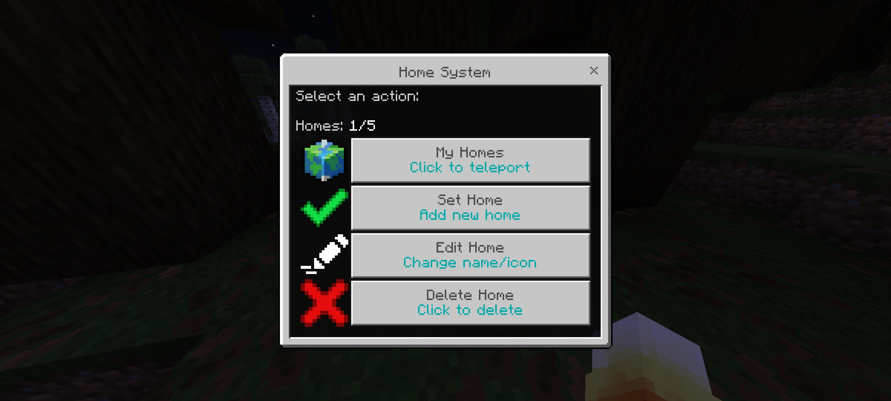
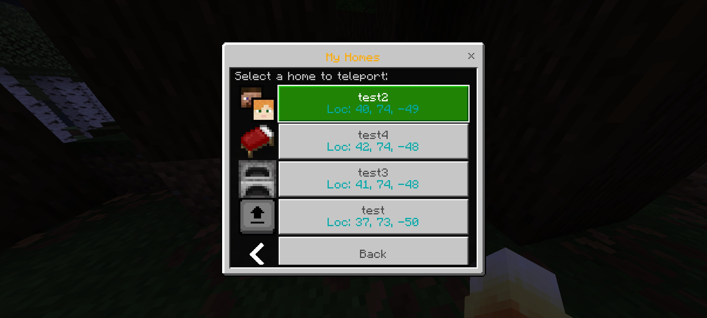
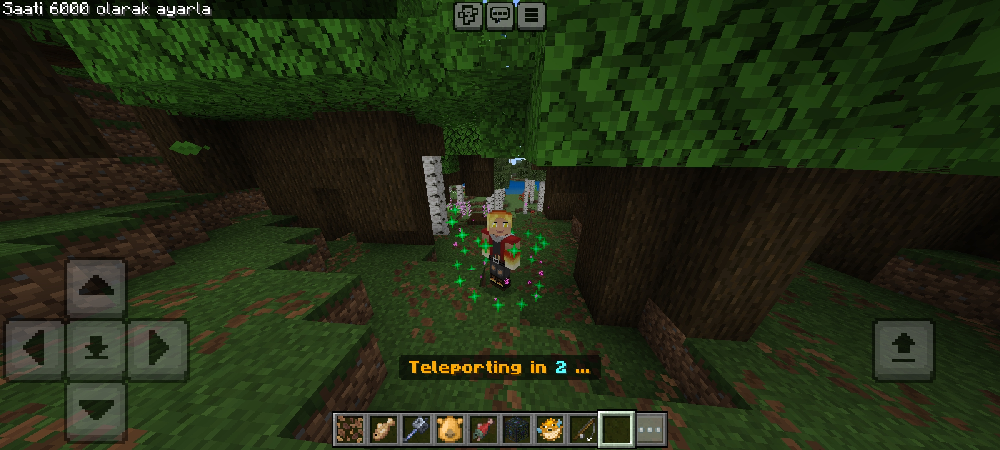

# SimpleHome - Advanced Home UI for PowerNukkitX

<div align="center">


**The Ultimate Home Management Plugin for PowerNukkitX**
*User-Friendly UI • Immersive Effects • Dynamic Limits • Secure Data*

[Download](#installation) • [Features](#features) • [Configuration](#configuration)

</div>

---

## Overview

**SimpleHome** is a production-ready, fully graphical home management plugin written in **Kotlin**. It leverages the **PowerNukkitX Form API** to replace complex commands with an intuitive UI. Designed for modern servers, it offers a seamless experience with cinematic teleportation effects, group-based home limits, and secure UUID-based data storage.

## Features

### 🖥️ Professional User Interface (Form API)
*   **Interactive Forms:** Manage homes effortlessly via `SimpleForm` and `CustomForm` interfaces.
*   **CRUD Operations:** Set, List, Edit, and Delete homes without typing commands.
*   **Smart Navigation:** Integrated "Back" buttons and intuitive flow for better User Experience (UX).
*   **Visual Customization:** Assign distinct icons to homes for quick recognition in the list.

### 🚀 Dynamic Home Limits (New in v1.1.0)
*   **Group-Based Limits:** Assign different home limits to player groups (e.g., VIPs get 5 homes, MVPs get 10) via permissions (`simplehome.limit.vip`).
*   **OP Privilege:** Server operators automatically have **unlimited** homes.
*   **Live UI Updates:** The interface displays "Unlimited" or remaining counts dynamically based on the player's rank.

### ✨ Immersive Teleportation Experience
*   **Pre-Teleport Effects:** A dynamic **DNA-Helix particle animation** (`EnchantmentTable` & `Portal` particles) circles the player during warmup.
*   **Audio Feedback:** A "Minigame-style" countdown with rising pitch sound effects (`Note Pling`) builds anticipation.
*   **Arrival Impact:** Successful teleportation is marked by a burst of `ElectricSpark` particles and a resonant sound effect.
*   **Cancellation Feedback:** A distinct bass sound alerts the player if teleportation is cancelled due to movement or damage.

### 🛡️ Security & Reliability
*   **Input Sanitization:** Forces strict Regex validation (`[a-zA-Z0-9_-]`) on home names to prevent invisible characters.
*   **UUID-Based Storage:** Player data is stored in `players/PlayerName.yml` but indexed internally by **UUID**, ensuring data persistence across name changes.
*   **World Whitelist:** Strictly enforces an "Allowed Worlds" policy to prevent exploiting restricted areas.

---

<div align="center">


<br><br>

<br><br>


</div>

---

## Installation

1.  Download the latest **`simplehome-1.1.0.jar`** from the [Releases](https://github.com/ClexaGod/SimpleHome/releases) page.
2.  Upload the file to your server's `plugins` folder.
3.  Restart the server.
4.  Configure permissions and limits in `config.yml`.

---

## Commands & Permissions

| Command | Description | Permission | Default |
| :--- | :--- | :--- | :--- |
| **`/home`** | Opens the main Home UI. | `simplehome.command.home` | `true` (Everyone) |

### Limit Permissions
Define custom limits in `config.yml`, then assign the corresponding permission:
*   `simplehome.limit.vip` -> Sets limit to 5 (example)
*   `simplehome.limit.mvp` -> Sets limit to 10 (example)

---

## Configuration

The `config.yml` allows full control over the plugin's behavior.

```yaml
# SimpleHome Configuration File

settings:
  teleport-delay: 3     # Warmup time in seconds before teleporting
  log-teleports: true   # Enable/Disable logging of teleport actions to 'teleport_logs.yml'

# Home Limits Configuration (New in v1.1.0)
# Define groups and their home limits here.
# Assign permission 'simplehome.limit.<group_name>' to players.
# Operators (OP) always have unlimited homes.
home-limits:
  default: 3
  vip: 5
  mvp: 10

# World Whitelist: Players can ONLY set homes in these worlds.
allowed-worlds:
  - "world"
  - "plots"
  - "nether"

effects:
  particles: true       # Enable visual particle effects (Helix & Burst)
  sound: true           # Enable sound effects (Countdown & Arrival)
```

---

## Build from Source

Required: **JDK 21** and **Maven**.

```bash
git clone https://github.com/ClexaGod/SimpleHome.git
cd SimpleHome
mvn clean package
```

The compiled plugin will be generated in `target/simplehome-1.1.0.jar`.

---

<div align="center">

**Keywords:** *PowerNukkitX, PNX Plugin, Home System, Teleport UI, Kotlin, Form API, GUI, SimpleHome, Bedrock Edition*

Made with ❤️ by **ClexaGod** for the PowerNukkitX Community.

</div>